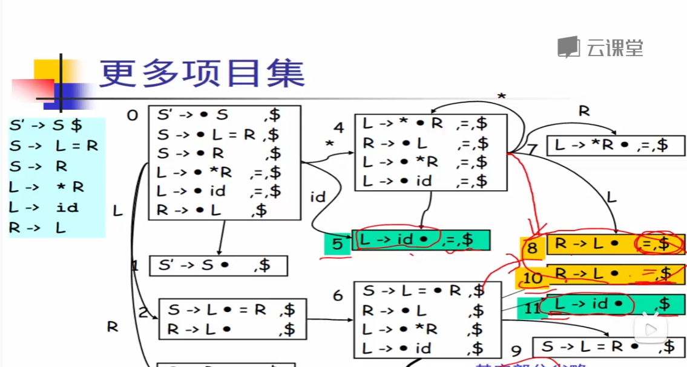

设计文档

读入模块
Z -> a|Xgg|Y
会分解为
Z -> a
Z -> Xgg
Z -> Y

### 文法（production）存储结构

left左部编号
right右部数组

### 所有的文法左部（冗余段） 

#### 文法的索引 ：实际上用不上

{文法左部，整体编号}
整体编号：对单个文法整体的编号

#### NullAble空集合的计算
一个集合，如果在这个集合中的左部，不可以为空，是否可以为空

####  fist集合结构

二维表
纵索引-文法整体的编号
横索引-无，直接存放first集合本身

#### follow集合结构

二维表
纵索引-文法整体的编号
横索引-无，直接存放follow集合本身

#### 分割后的文法索引表--二级索引表
一级，文法left
二级，文法右部
结果-顺序编号i
直接存放分割后的文法右部的索引

#### first_s集合

计算first_s的集合需要计算follow和frist
由分割后的文法编号分类，然后由两类集合推演而来

### LR1的DFA的构造

